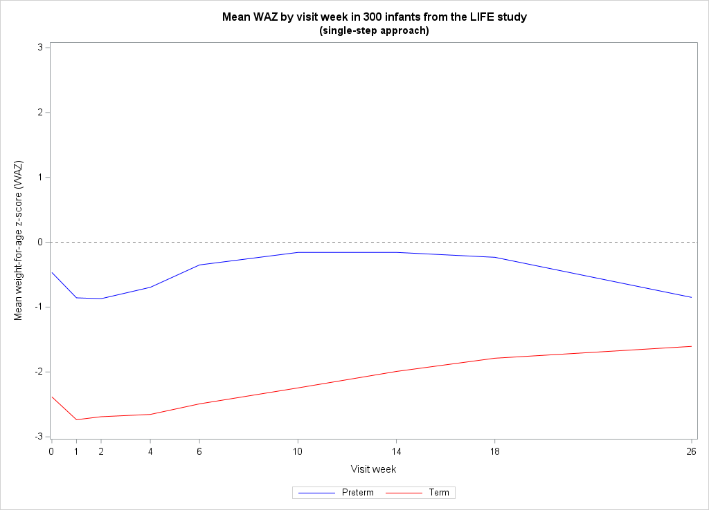
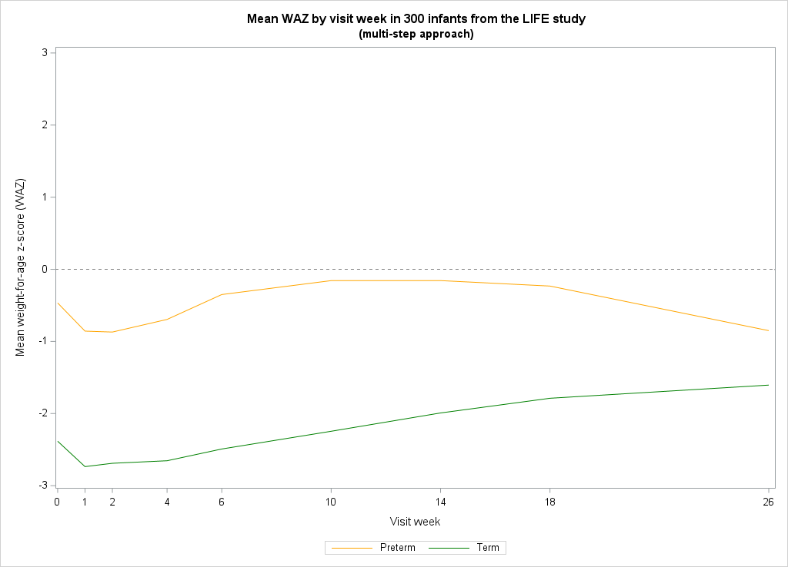
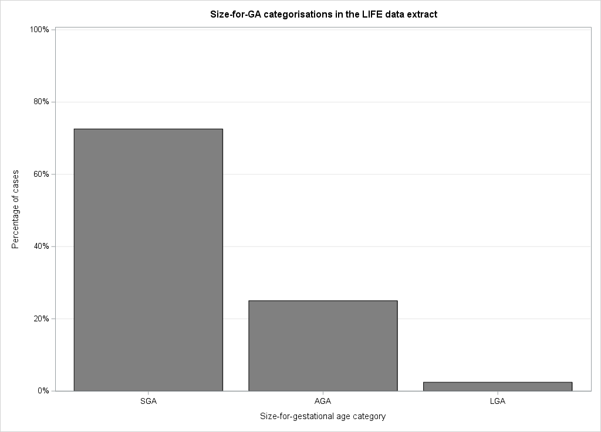
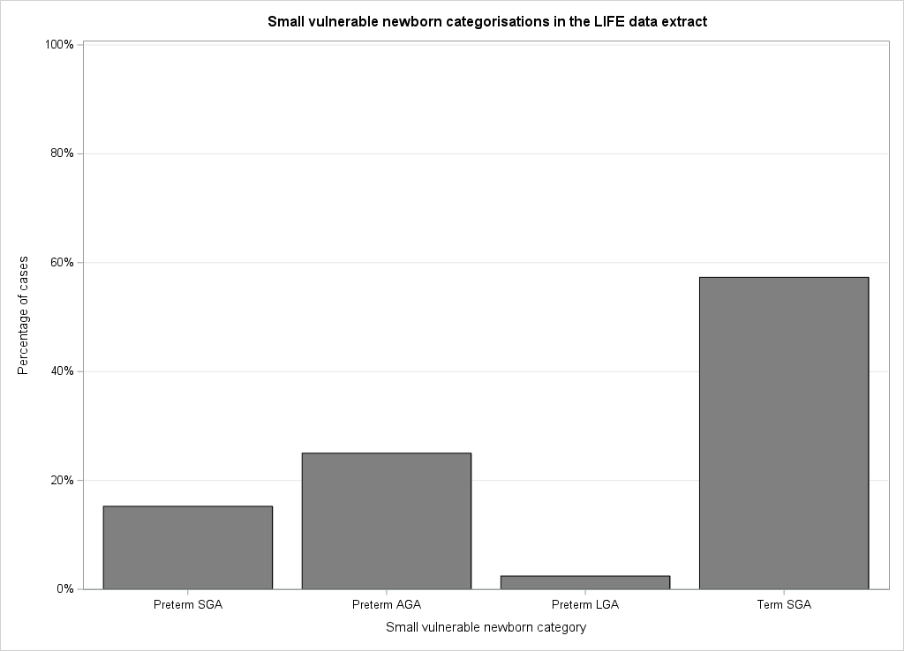

# Guidance for International Growth Standards (GIGS)

---

# Introduction

GIGS is a package designed to make the implementation of the international growth standards
from the INTERGROWTH-21<sup>st</sup> project and World Health Organisation Child Growth
Standards as easy as possible. It also provides functions for easy and
reproducible classification of fetal, newborn, and infant growth
standards from the INTERGROWTH-21<sup>st</sup> project. The package allows conversions and
classifications of growth measurements to centiles, z-scores, and common international
metrics such as stunting.

# Getting started

Let's start by loading the `gigs` package and 
learn how to get started with the basics of `gigs` package for SAS.

```sas
filename packages "/a/path/to/packages/on/your/computer";
%include packages(SPFinit.sas)

%loadPackage(gigs)
```
Look into the `README.md` or the documentation for more details about installing and loading SAS packages.


We provide two examples on the application of `gigs`.
The first is using `gigs` to convert growth measurements into 
centiles or z-scores according to the appropriate standards from either
INTERGROWTH-21<sup>st</sup> or WHO Child growth standards.

## Example data
This tutorial uses a sample of data from 300 infants enrolled in the low 
birth weight Infant Feeding Exploration (LIFE) study [[Vesel2022LowSettings](#vesel2022lowsettings); [Vesel2023FeedingStudy](#vesel2023feedingstudy)]. These infants were
assessed at birth then followed up at intervals after birth, with data available
up to six months of age in this data extract. We refer to the dataset as `_tmpgigs.life6mo`.


Though `_tmpgigs.life6mo` dataset has data on length in cm (`len_cm`), head circumference
(`headcirc_cm`), and mid-upper arm circumference (`muac_cm`), we are going to
subset this dataset to focus on weight in kilograms (`weight_kg`). 
The dataset contains variables: ID number per infant in the study (`id`), the
gestational age at birth for each infant (`gest_days`), the sex of each infant
(`sex`; `"M"` = male, `"F"` = female), the visit week at which weight (in kilograms) was
recorded (`visitweek`), and post-menstrual age in days (`pma`).

After loading the package, the data set is present in the `_tmpgigs` library.
We create a copy of `_tmpgigs.life6mo` in the `work` library and 
we add a variable `preterm`, which is set to `"Preterm"` wherever
an infant was born before 37 weeks' gestational age and `"Term"` otherwise. 

```sas
data work.life6mo;
  set _tmpgigs.life6mo(
    keep=id visitweek sex 
         pma age_days gest_days 
         wt_kg
    );
  preterm = ifc(37*7 > gest_days,"Preterm","Term");
  label
    preterm = 
      "Preterm when an infant was born before 37 weeks' gestational age; Term otherwise"
  ;
run;
proc print data=life6mo(obs=6) label;
run;
```

# Using `gigs` to convert growth measurements to z-scores

## Single-step approach

The easiest way to use `gigs` is to let it handle work for you. Using its growth
classification functions, you can apply GIGS-recommended growth standards for
each measurement and time point in a dataset. Standards are applied based on the
best practices advised by WHO and INTERGROWTH-21<sup>st</sup> when using their
respective growth standards.

We can use `%gigs_classify_growth()` macro or `call gigs_classify_wfa()` subroutine to add weight-for-age z-scores to our dataset in a
single step. 


Macro approach:

```sas
/* %helpPackage(gigs, gigs_classify_growth) */

%gigs_classify_growth(
 Life6mo
,dataOut=RESULT1
,weight_kg=wt_kg
,outcomes=wfa
,by=id
)

proc print data=RESULT1(obs=6) label;
run;
```

Subroutine approach:

```sas
/* %helpPackage(gigs, gigs_classify_wfa) */

data RESULT2;
  set Life6mo;

  length waz 8 wfa wfa_outliers $ 20;
  call missing(waz, wfa, wfa_outliers);

  call gigs_classify_wfa(
    waz,
    wfa,
    wfa_outliers,
    wt_kg,
    age_days,
    gest_days,
    sex,
    0
  );
run;

proc print data=RESULT2(obs=6) label;
run;
```
(*Note*: Notice that in the second case labels are not added automatically to `waz`, `wfa`, and `wfa_outliers`)

On plotting the mean weight-for-age z-scores as a function of the visit week, we
see that preterm z-scores in the LIFE data extract are on average higher than
for term infants. This is expected for this dataset, as term infants in the
LIFE study were only included if they were particularly small at birth. In
contrast, preterm infants were included irrespective of their relative size at
birth.

```sas
ods graphics / width=1024px height=738px;
proc means data=RESULT1 noprint;
  class preterm visitweek;
  var waz;
  ways 2;
  output out=PRINT1 mean=mean_waz;
run;
proc sgplot data=PRINT1;
  title1 "Mean WAZ by visit week in 300 infants from the LIFE study";
  title2 "(single-step approach)";
  styleattrs datacontrastcolors=(blue red);
  refline 0 / lineattrs=(color=grey pattern=shortDash);
  series x=visitweek y=mean_waz / group=preterm name="s";
  xaxis label="Visit week" values=(0 1 2 4 6 10 14 18 26);
  yaxis label="Mean weight-for-age z-score (WAZ)" min=-3 max=3;
  keylegend "s" / location=outside position=bottom;
run;
```



---

## Multi-step approach

Instead of letting `gigs` do the heavy lifting, you may want to clearly lay out
the steps taken in your analysis. Luckily, `gigs` provides all the functionality
you need for this.

We start by generating WAZs for each growth standard. To do this, we need to use
the `gigs` conversion functions. These take numeric variables with growth data and convert them into z-scores or centiles. To get the right function, follow the `gigs`
conversion function naming scheme:

1. Start with the broad set of growth standards you want to use
   * `ig_fet` INTERGROWTH-21<sup>st</sup> Fetal standards [[Papageorghiou2014AInternationalPregnancy](#papageorghiou2014ainternationalpregnancy); [Stirnemann2017InternationalProject](#stirnemann2017internationalproject); [Papageorghiou2016InternationalCountries](#papageorghiou2016internationalcountries); [Papageorghiou2014BInternationalPregnancy](#papageorghiou2014binternationalpregnancy); [Drukker2020InternationalProject](#drukker2020internationalproject); [Rodriguez-Sibaja2021FetalProject](#rodriguezsibaja2021fetalproject); [Stirnemann2020IntergrowthWeight](#stirnemann2020intergrowthweight)]
   * `ig_nbs` - INTERGROWTH-21<sup>st</sup> Newborn Size Standards (incl. very preterm) [[Villar2014InternationalProject](#villar2014internationalproject); [Villar2016INTERGROWTH-21stCharts](#villar2016intergrowth-21stcharts); [Villar2017BodyProject](#villar2017bodyproject)]
   * `who_gs` - INTERGROWTH-21<sup>st</sup> Postnatal Growth Standards [[Villar2015PostnatalProject](#villar2015postnatalproject)]
   * `ig_png` - INTERGROWTH-21<sup>st</sup> WHO Child Growth Standards [[WHOMulticentreGrowthReferenceStudyGroup2006WHOAge](#whomulticentregrowthreferencestudygroup2006whoage); [WHO2006WHODevelopment](#who2006whodevelopment); [WHO2007WHODevelopment](#who2007whodevelopment)]
2. The type of conversion we want to perform:
   *  `value2zscore`
   *  `value2centile`
   *  `zscore2value`
   *  `centile2value`
3. Then use the `acronym` parameter in these functions to tell `gigs` exactly
   which growth standard to use. Valid values for `acronym` are detailed in the
   documentation for each conversion function. You can provide acronyms either:
    -   As an argument within a function call, e.g.
        -   `gigs_ig_nbs_value2zscore(..., acronym = "wfga")`
        -   `gigs_ig_png_value2zscore(..., acronym = "wfa")`
        -   `gigs_who_gs_value2zscore(..., acronym = "wfa")`
    -   As part of the function name, e.g.
        -   `gigs_ig_nbs_wfga_value2zscore()`
        -   `gigs_ig_png_wfa_value2zscore()`
        -   `gigs_who_gs_wfa_value2zscore()`


```sas
data RESULT3;
  set Life6mo;

    waz_nbs = gigs_ig_nbs_value2zscore(
            wt_kg,
            gest_days,
            sex,
            "wfga"); /*acronym*/

    waz_who = gigs_who_gs_value2zscore(
            wt_kg,
            age_days,
            sex,
            "wfa"); /*acronym*/

    waz_png = gigs_ig_png_value2zscore(
            wt_kg,
            pma / 7,
            sex,
            "wfa"); /*acronym*/
run;
proc print data=RESULT3(obs=6) label;
run;
```

Once we have our standard-specific WAZs, we can use an `if-then-else` conditional logic to make one overall `waz` column in `RESULT4`:

```sas
data RESULT4;
  set RESULT3;

  if age_days <= 0.5 
    then waz = waz_nbs;
  else
    if (age_days > 0.5 and preterm='Term') 
       or (preterm="Preterm" and pma > 64 * 7)
      then waz = waz_who;
    else waz = waz_png; 

run;
```

On plotting the mean WAZ for each visit week, we get the same plot as when we
used the z-scores from `gigs_classify_wfa()`!

```sas
ods graphics / width=1024px height=738px;
proc means data=RESULT4 noprint;
  class preterm visitweek;
  var waz;
  ways 2;
  output out=PRINT4 mean=mean_waz;
run;
proc sgplot data=PRINT4;
  title1 "Mean WAZ by visit week in 300 infants from the LIFE study";
  title2 "(multi-step approach)";
  styleattrs datacontrastcolors=(orange green);
  refline 0 / lineattrs=(color=grey pattern=shortDash);
  series x=visitweek y=mean_waz / group=preterm name="s";
  xaxis label="Visit week" values=(0 1 2 4 6 10 14 18 26);
  yaxis label="Mean weight-for-age z-score (WAZ)" min=-3 max=3;
  keylegend "s" / location=outside position=bottom;
run;
```




---

# Obtaining growth classifications from measurements
The `gigs` package contains call subroutines and functions to classify growth in several ways:

* Size-for-gestational age with `gigs_compute_sfga()`/`call gigs_classify_sfga()`
* Small, vulnerable newborns with `gigs_compute_svn()`/`call gigs_classify_svn()`
* Stunting with `gigs_compute_stunting()`/`call gigs_classify_stunting()`
* Wasting with `gigs_compute_wasting()`/`call gigs_classify_wasting()`
* Weight-for-age with `gigs_compute_wfa()`/`call gigs_classify_wfa()`
* Head size with `gigs_compute_headsize()`/`call gigs_classify_headsize()`


You can also obtain classifications for all (or some) of these outcomes
simultaneously using the `%gigs_classify_growth()` macro. In this vignette, we will focus on size-for-GA and
small, vulnerable newborn (SVN) classifications.

## Size-for-GA


We can use `compute_sfga()` to obtain counts of size-for-GA categories in this dataset. We can then convert these counts to percentages:

```sas
data RESULT5;
  set Life6mo;
  where visitweek = 0 AND age_days < 0.5;

  sfga = gigs_compute_sfga(
    wt_kg,
    gest_days,
    sex,
    0
  );
run;
proc freq data=RESULT5;
  table sfga / nocum;
run;
```

---


| sfga | Frequency | Percent |
|:----:|----------:|--------:|
|AGA   |       41  |   25.00 |
|LGA   |        4  |    2.44 |
|SGA   |      119  |   72.56 |

---

```sas
proc sgplot data=RESULT5;
  title "Size-for-GA categorisations in the LIFE data extract";
  vbar sfga / stat=percent categoryorder=respdesc fillattrs=(color=grey);
  xaxis label="Size-for-gestational age category"; 
  yaxis label="Percentage of cases" min=0 max=1 grid;
run;
```



In this dataset, the bulk of newborns are SGA - but what
if we take the gestational ages into account?

## Small vulnerable newborns

The full SVN framework stratifies small, at-risk newborns based on a combination of their size-for-GA, whether they were low birth-weight (LBW; birth weight < 2500g), and whether they were born term or preterm [[Ashorn2023SmallImpact](#ashorn2023smallimpact)]. In a global analysis of SVN type prevalence and mortality, Lawn et al. [[Lawn2023SmallCounting](#lawn2023smallcounting)] focused on a smaller subset of SVN categories which omitted whether infants were LBW. The gigs package offers SVN classification functionality for this smaller subset of SVN categories, as 99.5% of global LBW is the consequence of preterm birth and SGA.

To classify SVN in gigs, the `gigs_compute_svn()` function can be used. We can then convert the counts for each SVN category to percentages, and plot the results:

```sas
resetline;
data RESULT6;
  set Life6mo;
  where visitweek = 0 AND age_days < 0.5;

  svn = gigs_compute_svn(
    wt_kg,
    gest_days,
    sex
  );
run;
proc freq data=RESULT6;
  table svn / nocum;
run;
```

---

| svn         | Frequency | Percent |
|:-----------:|----------:|--------:|
|Preterm AGA  |       41  |   25.00 |
|Preterm LGA  |        4  |    2.44 |
|Preterm SGA  |       25  |   15.24 |
|Term SGA     |       94  |   57.32 |

---

On plotting this data, we find that the bulk of SGA cases are from term infants. We would usually expect that size-for-GA categories were distributed similarly for preterm and term infants. However, due again to the sampling process for the LIFE study, we should expect that the term infants are SGA whilst the preterm infants are a mix of SGA/AGA/LGA.

```sas
proc sgplot data=RESULT6;
  title "Small vulnerable newborn categorisations in the LIFE data extract";
  vbar svn / stat=percent categoryorder=respdesc fillattrs=(color=grey);
  xaxis label="Small vulnerable newborn category"
        values=("Preterm SGA" "Preterm AGA" "Preterm LGA" "Term SGA"); 
  yaxis label="Percentage of cases" min=0 max=1 grid;
run;
```



---

# References


1. <a name="vesel2022lowsettings"></a> Vesel, L. *et al.* [Low birthweight infant feeding practices and growth patterns in the first six months of life in resource-limited settings](https://doi.org/10.1093/cdn/nzac060.069). *Current Developments in Nutrition* **6**, 611 (2022).

2. <a name="vesel2023feedingstudy"></a> Vesel, L. *et al.* [Feeding practices and growth patterns of moderately low birthweight infants in resource-limited settings: Results from a multisite, longitudinal observational study](https://doi.org/10.1136/bmjopen-2022-067316). *BMJ Open* **13**, e067316 (2023).

3. <a name="villar2014internationalproject"></a> Villar, J. *et al.* [International standards for newborn weight, length, and head circumference by gestational age and sex: The Newborn Cross-Sectional Study of the INTERGROWTH-21st Project](https://doi.org/10.1016/s0140-6736(14)60932-6). *The Lancet* **384**, 857–868 (2014).

4. <a name="villar2016intergrowth-21stcharts"></a> Villar, J. *et al.* [INTERGROWTH-21st very preterm size at birth reference charts](https://doi.org/10.1016/S0140-6736(16)00384-6). *The Lancet* **387**, 844–845 (2016).

5. <a name="villar2017bodyproject"></a> Villar, J. *et al.* [Body composition at birth and its relationship with neonatal anthropometric ratios: the newborn body composition study of the INTERGROWTH-21st project](https://doi.org/10.1038/pr.2017.52). *Pediatric Research 2017 82:2* **82**, 305–316 (2017).

6. <a name="villar2015postnatalproject"></a> Villar, J. *et al.* [Postnatal growth standards for preterm infants: The Preterm Postnatal Follow-up Study of the INTERGROWTH-21st Project](https://doi.org/10.1016/S2214-109X(15)00163-1). *The Lancet Global Health* **3**, e681–e691 (2015).

7. <a name="whomulticentregrowthreferencestudygroup2006whoage"></a> WHO Multicentre Growth Reference Study Group &amp; de Onis, M. [WHO Child Growth Standards based on length/height, weight and age](https://doi.org/10.1111/j.1651-2227.2006.tb02378.x). *Acta Paediatrica Supplement* **450**, 76–85 (2006).

8. <a name="who2006whodevelopment"></a> World Health Organisation. [WHO child growth standards: length/height-for-age, weight-for-age, weight-for-length, weight-for-height and body mass index-for-age: methods and development](https://doi.org/10.1111/j.1651-2227.2006.tb02378.x). 1–312 (2006).

9. <a name="who2007whodevelopment"></a> World Health Organisation. *WHO child growth standards: head circumference-for-age, arm circumference-for-age, triceps skinfold-for-age and subscapular skinfold-for-age: methods and development*. 1–237 (2007).

10. <a name="lawn2023smallcounting"></a> Lawn, J. E. *et al.* [Small babies, big risks: global estimates of prevalence and mortality for vulnerable newborns to accelerate change and improve counting](https://doi.org/10.1016/S0140-6736(23)00522-6). *The Lancet* **401**, 1707–1719 (2023).

11. <a name="papageorghiou2014ainternationalpregnancy"></a> Papageorghiou, A. T. *et al.* [International standards for fetal growth based on serial ultrasound measurements: The Fetal Growth Longitudinal Study of the INTERGROWTH-21st Project](https://doi.org/10.1016/S0140-6736(14)61490-2). *The Lancet* **384**, 869–879 (2014).

12. <a name="stirnemann2017internationalproject"></a> Stirnemann, J. *et al.* [International estimated fetal weight standards of the INTERGROWTH-21st Project](https://doi.org/10.1002/uog.17347). *Ultrasound in Obstetrics & Gynecology* **49**, 478–486 (2017).

13. <a name="papageorghiou2016internationalcountries"></a> Papageorghiou, A. T. *et al.* [International standards for symphysis-fundal height based on serial measurements from the
Fetal Growth Longitudinal Study of the INTERGROWTH-21st Project: Prospective cohort study in eight countries](https://doi.org/10.1136/bmj.i5662). *BMJ* **355**, i5662 (2016).

14. <a name="papageorghiou2014binternationalpregnancy"></a> Papageorghiou, A. T. *et al.* [International standards for early fetal size and pregnancy dating based on ultrasound measurement of crown–rump length in the first trimester of pregnancy](https://doi.org/10.1002/uog.13448) *Ultrasound in Obstetrics &amp; Gynecology* **44**, 641–648 (2014).

15. <a name="drukker2020internationalproject"></a> Drukker, L. *et al.* [International gestational age-specific centiles for umbilical artery Doppler indices: A longitudinal prospective cohort study of the INTERGROWTH-21st Project](https://doi.org/10.1016/j.ajog.2020.01.012). *American Journal of Obstetrics &amp; Gynecology* **222**, 602.e1–602.e15 (2020).

16. <a name="rodriguezsibaja2021fetalproject"></a> Rodriguez-Sibaja, M. J. *et al.* [Fetal cerebellar growth and Sylvian fissure maturation: International standards from Fetal Growth Longitudinal Study of INTERGROWTH-21st Project](https://doi.org/10.1002/uog.22017). *Ultrasound in Obstetrics & Gynecology* **57**, 614–623 (2021).

17. <a name="stirnemann2020intergrowthweight"></a> Stirnemann, J., Salomon, L. J. & Papageorghiou, A. T. [INTERGROWTH‐21st standards for Hadlock’s estimation of fetal weight](https://doi.org/10.1002/uog.22000). *Ultrasound in Obstetrics &amp; Gynecology* **56**, 946–948 (2020).

18. <a name="ashorn2023smallimpact"></a> Ashorn, P. *et al.* [Small vulnerable newborns—big potential for impact](https://doi.org/10.1016/S0140-6736(23)00354-9). *The Lancet* **401**, 1692–1706 (2023).

